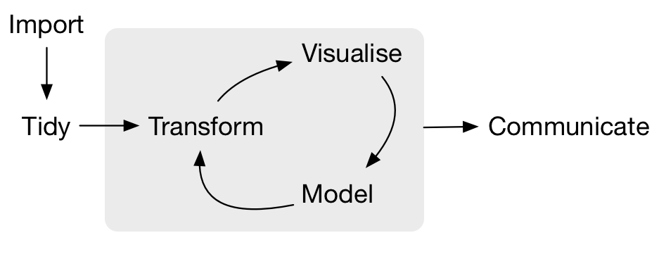
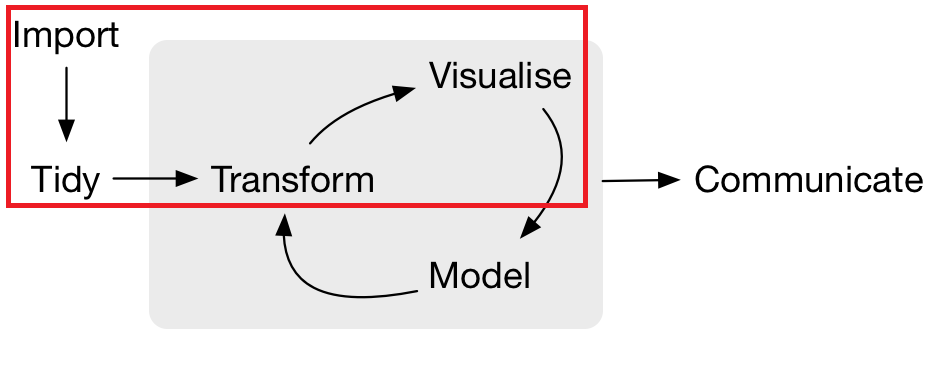
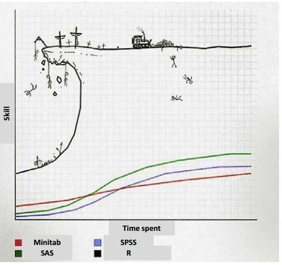
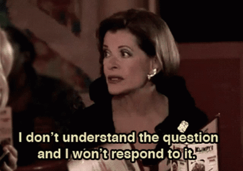

```{r setup, include=FALSE}
knitr::opts_chunk$set(echo = FALSE)
```

## NSC-R team

-   Wim Bernasco
-   Sam Langton
-   Asier Moneva
-   Alex Trinidad
-   Franziska Yasrebi-de Kom

## The workshop

-   Help participants transform from R novices to R users!
-   Supported by Data and Software Carpentries
-   Material is online and open

## Workflow

<br>

<center>

{width="80%"}

</center>

<br>

<br>

Source: R for Data Science

## Workflow

<br>

<center>

{width="80%"}

</center>

<br>

<br>

Source: R for Data Science

## Work contents

### Day 1 (5 October)

- The basics
- Packages
- Import 
- Explore
- Tidy

### Day 2 (12 October)

- Transform
- Join
- Visualise

## Disclaimer: learning curve

<center>

{width="70%"}

</center>

## Workshop ethos

<center>

{width="65%"}

</center>

## Day 1: morning

**09:30-10:00**: Introduction

**10:00-11:00**: The basics

**11:00-11:15**: Coffee

**11:15-12:00**: Exercise: using a script

**12:00-13:00**: Lunch

## Day 1: afternoon

**13:00-14:00**: Import & explore

**14:00-14:45**: Exercise: import & explore

**14:45-15:00**: Coffee

**15:00-16:00**: Tidy

**16:00-16:45**: Exercise: tidy

**16:45-17:00**: Closing

## Material

All slides and worksheets are available online:

<center>

<font color = "blue"> Link to the website/dropbox! </font>

</center>

## Day 2: morning

**09:30-10:00**: Introduction

**10:00-11:00**: Joining

**11:00-11:15**: Coffee

**11:15-12:00**: Exercise: joining

**12:00-13:00**: Lunch

## Day 2: afternoon

**13:00-14:00**: Transform

**14:00-14:45**: Exercise: transform

**14:45-15:00**: Coffee

**15:00-16:00**: Visualise

**16:00-16:45**: Exercise: visualise

**16:45-17:00**: Closing

