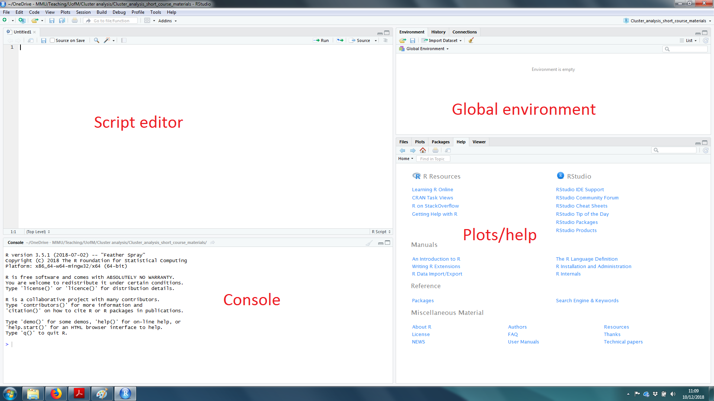
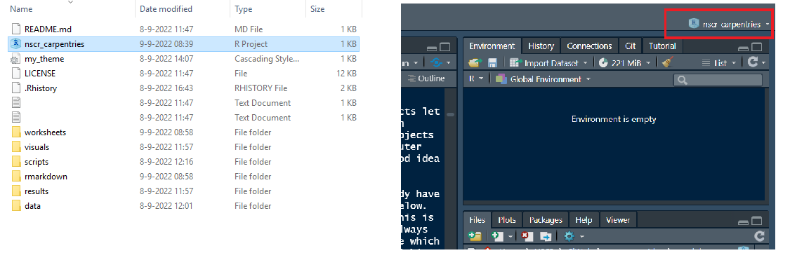
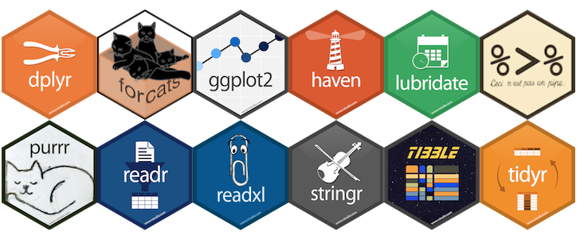

```{r setup, include=FALSE}
knitr::opts_chunk$set(echo = TRUE)
library(crimedata)
```

## Preamble

This page contains material for _NSCR Carpentries_, a two-day workshop hosted by the [NSCR](https://nscr.nl/) with support from [Data and Software Carpentries](https://carpentries.org/) on 5 and 12 October, 2022.

## Getting started

### Introducing R and RStudio

R is a programming language and open source software environment. Although it is widely described as a statistics programme, R can be used for a variety of other tasks, such as text analysis, web scraping, mapping and spatial analysis, web dashboards and document preparation. Even this worksheet was created in R -- so is the NSC-R team's [website](https://nscrweb.netlify.app/).

In reality, many of us will spend most of our time on importing, tidying, transforming and visualising our data. This is like the infamous '80:20' rule. 80% of your time will be spent on wrangling with the data, 20% will be spent on actually running fancy statistical models. You might get the answers you want without even running any fancy statistics!

So, this is what we focus on: wrangling and visualisation. Getting these basics nailed early on will drastically improve the efficiency of many research tasks through automation, and open up a variety of new tools that are not available in more 'traditional' software like Excel. Perhaps even more importantly, it will also make your research transparent and reproducible (both for yourself, and others).W

Although R is available as a stand-alone piece of software, it is most commonly used through a user-friendly interface _RStudio_. We recommend that you first [download R](https://cran.r-project.org/bin/windows/base/) and then [download RStudio](https://www.rstudio.com/products/rstudio/download/). All the examples in this workshop will be done in _RStudio_. We'll cover (or have covered) the basics of the _RStudio_ interface during live demonstrations, but as a reminder, there are four main windows: the script editor, console, global environment and help/plots.

- **Script editor** This is where you will write and execute your code. Importantly, scripts can be saved, edited, re-used, even sent to other people for their own use. When you view data, it will appear in this window next to your script. You can open a new script by clicking the green/white plus symbol in a white box, on the very top left in RStudio, and selecting 'R Script'.
- **Console** When you execute code from the script, it will appear in the console. Depending on what you're doing, the output of your code might appear here too, such as the results of some analysis. It's not good practice to type and execute code into the console, because the code is not saved and cannot easily be returned to at a later date. That's why the script is useful!
- **Global environment** Although this window contains a number of tabs, the most important is the _environment_ (sometimes referred to as your 'workspace'). This will show whatever you happen to be working on, for instance, any data that you've loaded will be shown here, including a brief summary of whatever it is.
- **Plots/help** Any plots or graphics you create will automatically be shown in the _plots_ tab. You can cycle back through previous plots using the arrows. The _help_ tab contains a number of useful resources, such as links to cheat sheets and introductory manuals. We'll discuss packages a bit later, but the _packages_ tab contains a list of all the packages you've installed, including options to load or update them. You probably won't need the _files_ or _viewer_ tabs for now, but ask away if you're interested!

<br>

<center>

{width="100%"}

</center>

<br>

### Starting a project

A lot of things in RStudio are easier if you work inside what's called a project. Projects let you keep all your R code for a particular piece of work self-contained, and mean you can switch between projects while keeping all the tabs in RStudio just as you left them. Projects also make it easier to collaborate with other people, because irrespective of what computer you are working on, you will all be working within the same folder structure. It's a good idea to always work inside a project if you are using RStudio.

Luckily for you, assuming you have downloaded all the workshop material, you will already have a pre-prepared project. Your folder structure will look something like the screenshot below. You will notice a file called **nscr_carpentries** which has the file extension .Rproj. This is the R project for the workshop. Throughout today and next week, we recommend that you always work within this project. Opening this file will automatically open RStudio. You can see which project you are working on in the top right. This should confirm that you are working within the **nscr_carpentries** project.

<br>

<center>

{width="100%"}

</center>

<br>

For future reference, and your own work going forward, you can set up an R project yourself with just a few clicks. We recommend [this brief tutorial](https://bookdown.org/daniel_dauber_io/r4np_book/starting-your-r-projects.html). But, there's no need to do this now, unless you really want to!

### Objects and functions

Code in R tends to be made up of two parts: functions and objects. Functions do things to whatever you input. This might be as simple as calculating the mean of a list of numbers. An object is anything that you create, and can take any form. A common example might be a data frame, but objects can also be things like a list of words, a single number, or a graphic. You can create an object by using the assign operator `<-`. Anything on the left hand side of `<-` will be the object that you are creating, and anything to the right is going to define what that object is, often through the use of a function. [Andy Field](https://uk.sagepub.com/en-gb/eur/discovering-statistics-using-r/book236067) summarises this as `object <- function`. You can read this as 'object is created from function'. You can call objects whatever you want, but it's good practice to give them meaningful names.

In the example below, we create an object without even using a function. Type (or copy) this into your script, highlight it (or click on the line of code) and hit `Ctrl + Enter` to execute it. For Mac, this shortcut is `Command + Enter`.

```{r}
city <- "Amsterdam"
```

The executed code will appear in the console. You'll notice that nothing else actually happens: all you've done is create an object called `city` which contains the word "Amsterdam". This object will appear in your global environment in the top-right of RStudio. If you want to print the contents of an object to the console simply execute the name of the object with `Ctrl + Enter`. For example:

```{r}
city
```

Be careful when typing: R is case-sensitive! It wouldn't recognise `City` or `CITY` even if the object `city` exists.

You can assign anything to an object. If we want to assign a series of numbers (or words), we use a similar concept to concatenate in Excel, simply to let R know that we are giving it more than one of something.

```{r}
my_numbers <- c(1, 2, 3, 4, 5, 6, 7, 8, 9) 
```

Functions can now be applied to this object. To find the mean, we can simply run:

```{r}
mean(my_numbers)
```

Although if you wanted to save the answer, you'd need to assign it to an object too. For example:

```{r}
mean_my_numbers <- mean(my_numbers)
```

You can remove objects from your global environment using the `rm()` function. Note that re-assigning something to an existing object with the same name will simply overwrite the original. So, if you don't want to lose anything, use new names for any new objects you create. The following would get rid of the `mean_my_numbers` object.

```{r}
rm(mean_my_numbers)
```

If you want to know more about a function, you can type `?` before the function name and then run the code. For example running `?mean` will bring up the help page for the function `mean` in the help/plot window in the bottom right of your interface.

### Types and classes

So far, we've been creating what are termed [vectors](http://adv-r.had.co.nz/Data-structures.html). Vectors are the most basic structure of data in R, and are simply just a collection of things which are the same type. You can check what type a vector is using the function `typeof()`, or the (more broad) class with `class()`. There are a few different types and classes of vector in R, and we recommend that you read this [article about object types](https://swcarpentry.github.io/r-novice-inflammation/13-supp-data-structures/) to understand them more.

A data structure you will be familiar with is a data frame. In R, you can think of a data frame as a list of vectors (i.e. columns, variables) of equal length (i.e. same number of rows). For instance, we can create a new data frame in a similar manner to how we created vectors above, but pre-specify we want to stick these together to create a data frame. This data frame has three variables (vectors, columns) of the same length (3 rows).

```{r}
example_df <- data.frame(var1 = c("id1", "id2", "id3"),
                         var2 = c(1200, 5444, 8333),
                         var3 = c("Amsterdam", "Groningen", "Delft"))
example_df
```

We don't dwell too much on this here, but for now, it's important to be aware that the type of vector you are dealing with will dictate what you can do with it. It's the reason why we can calculate the mean of `my_numbers` or `var2` but not `city` or `var3`, for instance. Whilst this might seem obvious, it's worthwhile being aware of these different types and classes. You can complete the exercises today without looking at the reading links above, but we recommend you return to it later on.

### Installing packages

R comes with a huge amount of built-in functionality. You can load, manipulate, analyse and visualise data simply with the tools you have already upon download. In the above example, we used the function `mean()`. This is an example of a function which is available to use as standard in R. That said, the real power and versatility of R comes with additional _packages_ which you can install (for free) from within the software. There are thousands of R packages out there, but there is a specific group of packages which have been designed around a common philosophy, and can be used in conjunction with one another. Collectively these are referred to as the `tidyverse`. You can read more about the tidyverse in the (legitimately) free book [R for Data Science](https://r4ds.had.co.nz/), which covers the fundamentals of data science in R.

<br>

<center>

{width="100%"}

</center>

<br>

To install the tidyverse in R, you can run the following code. Once installed, you tend not to have to reinstall packages, so this is a rare occasion when you can simply type or copy and paste the code into the console and hit `Enter`, rather than typing it into the script editor. Because the tidyverse is quite extensive, containing a number of packages, the install may take a few minutes.

```{r, eval = F}
install.packages('tidyverse')
```

A summary of what has been installed will appear in the console. Warnings in red are not always bad, and we will cover them more in the live demonstration. You now have the tidyverse installed! 

### Loading packages

Installing packages is a one-time thing, but each time you open a new session in R, you need to load the packages you want to use. You can do this by ticking the box of whichever one you want to load in the _packages_ tab of the help/plots window. However, it is good practice to load packages using code. You can do this using the `library()` function. Copy the following to load the tidyverse.

```{r, warning=F, message=F, results=F}
library(tidyverse)
```

## Importing data

Most of the time, you are going to be loading in your own data. This might be stored in a variety of formats, such as .dta or .sav depending on what software you are currently using, or you might have geographic data (for example .shp files). The chances are that R can load them, it just might require a different function.

A common format for storing data frames is .csv so that's the example we're going to use here. We're going to use the `read_csv()` function from the `readr` package within the tidyverse and assign the data to a new object. The contents of this function will be where the data is stored. If it's online, this will be a url, but if it's on your local drive, then it will be a working directory. I've put some data on github for this workshop, so we can load it simply by running this, using the url where the data is stored.

```{r, message = F}
stops <- read_csv("https://github.com/langtonhugh/ESC2019_materials/raw/master/2018-12-greater-manchester-stop-and-search_edit.csv")
```

This will create an object called `stops`, but you can call it whatever you want. You'll notice that a summary of this object will appear in your global environment. If you want to save the data for later use offline, first download the file to a local drive. You can do this manually, by following the link and saving as you might normally, but you can actually download the data within R using `download.file()`. The first 'argument' called `file` tells R where the data is, and the second argument `destfile` tells R where to save the data and what to call it. Assuming that you are working inside the RStudio project, the file location specified in `destfile` is relative to your project directory, which keeps everything self-contained.

```{r, eval = F}
download.file(url = "https://github.com/langtonhugh/ESC2019_materials/raw/master/2018-12-greater-manchester-stop-and-search_edit.csv", destfile = "data/stops_data.csv")
```

It's always a good idea to store an unaltered copy of any data on your computer, just in case the original version is later removed from the website you downloaded it from.

Once you've downloaded the file, load it in the same way using `read_csv()` but this time, we load it from wherever it was saved. Note again that this example demonstrates one benefit of using projects: we do not have to specify the whole working directory path (e.g.,         `C:/users/joedart/myproject ...`) because everything starts from the project folder by default.

```{r, eval = F}
stops <- read_csv(file = "data/stops_data.csv")
```

## Explore

Once you've loaded data into R (whichever way you've done it above), there's a few useful functions you can use to explore it a bit. Try each of these one at time and review the outcome. You'll notice that we've added comments after each line of code below as a brief explanation. Anything you write after a `#` is treated as a comment and is ignored by R when running chunks of code. It's useful to add comments as you go when writing code, explaining what you are doing and why. You will thank yourself for doing this when returning to code you wrote months earlier.

```{r, eval = F}
head(stops)         # Print the top 6 rows (i.e. observations) 
tail(stops)         # Print the bottom 6 rows
View(stops)         # View the data in a new window
sum(is.na(stops))   # Count missings in the data frame
nrow(stops)         # Number of rows
ncol(stops)         # Number of columns
summary(stops)      # Basic descriptives of each variable
glimpse(stops)      # Summary of each variable (e.g., classes, values)
```

We'll be making use of the `$` sign to generate descriptives about specific vectors (variables) within a data frame. To refer to a specific variable, you need to state the data frame object and then the variable name using this `$` symbol. So, to count the number of missing for a specific variable `age` in `stops` you would run:

```{r, eval = F}
sum(is.na(stops$age)) # There are 136 missings in the age variable
```

Or to print a basic frequency table:

```{r, eval = F}
table(stops$age)
```

As we'll see, one of the benefits of using the tidyverse is that you often don't need to use `$`, which can look quite messy, but it's definitely worth knowing. For instance, we could replicate the frequency count above using `count()` which is part of the `dplyr` package in the `tidyverse`.

```{r, eval = F}
count(stops, age)
```

## Transform

So far, we haven't really made much use of the tidyverse, but the some of the most useful functions are coming up. They are often termed 'verbs' because the function name corresponds more or less to what it's _doing_ to the object. Here, we focus on verbs that [transform](https://rstudio-education.github.io/tidyverse-cookbook/transform-tables.html) data: things like filtering, selecting columns and renaming variables. You will notice that we are covering **transform** before **tidy**. The precise ordering of your own workflow might differ, but one way or another, these transform functions will be super useful early on in own work. The key package within the `tidyverse` for transforming data is `dplyr`.

We are going to cover some of the most common:

- `filter()` to choose rows in a data frame by one or more conditions
- `select()` to choose columns by name
- `arrange()` to order rows according to the values of one or more columns
- `slice()` to choose rows by row number
- `rename()` to rename variables
- `mutate()` to create new variables
- `recode()` to recode variables

Along the way, we will also cover something called a pipe (coded as `%>%`). The pipe will help us link all these helpful verb functions together, ensuring we write code which is easily written, read and understood! We will then take a look at grouping (using `group_by()`) and conditional statements (using `if_else()`).

### Filter

We'll be using the stop and search data again for this. Let's say we are only interested in stop and search incidents in which the individual was arrested. We can filter the `outcome` variable by 'Arrest' and assign the new data frame to a new object. The first argument of `filter()` is the data frame, and the second is the condition. In this example we can do:

```{r}
stop_arrests <- filter(stops, outcome == "Arrest")
```

Take a look at this new object using the `View` function.

```{r, eval = F}
View(stop_arrests)
```

### Select

In some cases, you might only be interested in a small number of variables. Here, we select only the gender, age and ethnicity of the individual, along with the outcome of the stop and search, and create a new data frame. Again, the first argument is the data frame object, and the remaining are optional ones specifying the names of the variables.

```{r}
stops_subset <- select(stops, gender, age, ethnic, outcome)
```

If you are interested in all but one or two variables, it's easier to specify what you _don't_ want rather than what you _do_ want. Here, we are not interested in the legislation used for the stop and search. Notice that by assigning this new `select()` function to an object `stops_subset` we are overwriting the original. It doesn't matter here, but it's worth remembering. Generally speaking, it's best to try and _not overwrite any existing objects_ unless having too many is slowing your computer down. By keeping them all, you retain a trail of everything you've done, and can go back to old objects later on.

```{r}
stops_subset <- select(stops, -legislation)
```

### Arrange

To order the rows of a data frame, we can use `arrange()`. So, for example, if we want rows to appear in chronological order by day from top to bottom, we can run:

```{r}
stops_ordered <- arrange(stops, day)
```

Or to order in descending order (note that we are overwriting the existing object again):

```{r}
stops_ordered <- arrange(stops, desc(day))
```

### Slice

You might want to select a specific set of observations using `slice()`. This is especially useful if you have your data in a meaningful order. Here, we just use it to demonstrate selecting the first 10 rows of the `stops` data frame. We are using the `:` symbol to denote a sequence from 1 to 10.

```{r}
stops_first10 <- slice(stops, 1:10)
```

### Rename

Often, data has variables with excessively long names, or names which are not clear. The data here is not that bad, but some might need changing. For example `clothing_rm` tells us whether clothing had to be removed as part of the stop and search, but this might not be clear to some people. The `rename()` function makes changing variable names fairly easy.

```{r}
stops_renamed <- rename(stops, clothing_remove = clothing_rm)
```

### Mutate

To simplify or ease interpretation, you might want to create a new variable. This new variable might be entirely new, or a construction from an existing variable. This is where we can use the `mutate` function. 

In the first example, let's say we want to create an ID column for the `stops` data frame, whereby each row is assigned a number for the purposes of identification. Note that we make things a bit easier for ourselves here by using the `nrow()` function from earlier, instead of manually stating the number we need. We also use a colon `:` again to dictate that we want a sequence to run from 1 to the number of rows in `stops`. We are calling the new variable 'ID'.

```{r}
stops_with_id <- mutate(stops, ID = 1:nrow(stops))
```

### Mutate + recode

More commonly, you are going to recode existing variables to create a new one. Let's say we just want a two category variable indicating whether the individual was below 18. We need to combine categories in the `age` variable to do this. You'll notice that we are sandwiching the original categories with backward apostrophes (`). This is something that is needed when you are referring to variable categories or variable names which either _have spaces_ or _begin with a number_. This kind of thing will take a while to get used to, but once you are used to these little rules, they will become second nature.

```{r}
stops <- mutate(stops, age_recode = recode(
  age,
  `10-17`    = "Below 18",
  `18-24`    = "Over 18",
  `25-34`    = "Over 18",
  `over 34`  = "Over 18",
  `under 10` = "Below 18"
))
```

The new variable `age_recode` has now been created and appended to the `stops` data frame.

## Piping ` %>% `

You have now learnt a bit about some key verbs within the tidyverse. You'll have noticed that the first part of each function is the data frame object. For example, `stops_ordered <- arrange(stops, day)` is creating a new object called `stops_ordered` which is `stops` ordered by `day`. In more complex scripts, this can get quite repetitive and make your code unnecessarily long. There is a useful feature in the tidyverse `%>%` which allows you to 'pipe' the data frame through multiple lines of code, and through multiple verb functions. Using the pipe can make your code tidier and more concise.

In a basic example, we can rewrite the above `arrange` example using a pipe.

```{r}
# This:
stops_ordered <- arrange(stops, day)

# Does exactly the same as this:
stops_ordered <- stops %>%
  arrange(day)
```

As it stands, this isn't really more efficient. However, as soon as we start doing more complex things, you will see the benefits. The below example uses some of the tidyverse verbs we have introduced so far, but in one single chunk of code, and with only one mention of the `stops` data frame object. We've snuck in a new function at the end of this pipe to drop all rows that contain a missing value.

So, the following code takes the original `stops` data frame, subsets it by individuals who were arrested, selects a small number of important variables, renames a variable and drops observations with missing values, all in one chunk of code. The output of this is assigned to a new object called `stops_piped`. It is good practice to put each part of the pipe on a new line, so it's easier to read.

```{r}
stops_piped <- stops %>%                    
  filter(outcome == "Arrest") %>% 
  select(gender, age, ethnic, outcome, legislation) %>% 
  rename(ethnicity = ethnic) %>% 
  drop_na()
```

## Grouping

Now we have covered pipes, let's look at another super-useful functions: `group_by()`. This a key **transform** variable, but it is best used in conjunction with the pipe `%>%`.

To demonstrate `group_by()`, we want to make use of a new package. Usually you'll download packages because they contain useful functions which allow you to do something, like analyse or visualise data (e..g, `tidyverse`), but packages often also contain data. You'll have got a few with the tidyverse, but they are not crime specific. Lucky for you, [Matt Ashby](http://lesscrime.info/) has released a package called `crimedata` which contains lots of open data about police recorded crime from a number of large cities in the United States.  Install this package by editing the `install.packages()` code above for the `crimedata` package and then loading it using `library()`.

We can now easily access some US crime data using the function `get_crime_data()`. Let's just choose the core datasets from the year 2017. We assign the data to the object `crimes`.

```{r, warning = F, message = F, results=F}
crimes <- get_crime_data(years = 2017, type = "core")
```

We can practice some of our skills earlier to explore the data. You will notice that each row is an offence For each offence, we information like the type of offence, the city and the census block in which it occurred. For now, let's just subset the data to only include disorderly conduct offences.

```{r}
disorder <- crimes %>% 
   filter(offense_type == "disorderly conduct")
```

You will notice that there is a variable called `city_name` which tells us the city in which the crime occurred. Because each row is a crime, city names are repeated across rows, because each city had multiple offences during 2017. In this way, you can think of the data as 'grouped' because individual offences are nested with cities. 

A typical research question when looking at this data might be **How many crimes occurred in each city?**. There are a few ways we can answer this question, but the most versatile is `group_by()`. This function allows us to perform operations (i.e., use functions, do stuff) on groups in our data. Once we group the data using `group_by()`, any subsequent functions will be applied to the group, rather than individual rows. So, to count the number of crimes (i.e., rows) nested within each city, we first group the data, then pipe the grouped data through to `summarise()`, in which we create a new variable called `count` which is simply the number (`n`) of rows.

```{r}
city_counts <- disorder %>% 
  group_by(city_name) %>% 
  summarise(counts = n()) 

city_counts # print the data frame to the Console
```

You will notice that `summarise()` create a new data frame at whatever level we have specified in `group_by()`. This is subtly (but importantly) different from `mutate()` which adds a new variable to your existing data frame. Sometimes, using `mutate()` after `group_by()` does actually make sense, but what do you think would happen? Try running the above code using `mutate()` and observe what happens to the output. Remember that you might want to create a new data frame object to compare the two.

One of the powerful things about `group_by()` is that you can input multiple groups. Say we were interested in offence counts in each city, but also by the census blocks nested within each city. Then we could try something like this:

```{r}
city_block_counts <- disorder %>% 
  group_by(city_name, census_block) %>% 
  summarise(counts = n()) 

city_block_counts # print the data frame to the Console
```

So far, we have been using `n()` to count the number of rows in each unique group. But, there are plenty of other things you can do. For instance, you can also calculate the mean or standard deviations of groups in exactly the same way, but instead of `n()` you would state something like `mean(variable_name)`. 

## Conditions

Okay, the last function which we can use to wrangle our data is `if_else()`. This function is typically used to test conditions in one variable (i.e., 'this is statement true'), usually to then create a new value based on whether the statement is `TRUE` or `FALSE`. By way of example, the below code chunk would be a base R way of writing an `if else` statement. Essentially, we are testing the statement of whether x is greater or less than a specified value. We then print different outputs to the Console depending on whether it is true or not. Change the value of `x` to see what happens. You don't have to understand this code in detail, but rather, just focus on understanding the logic.

```{r}
x <- 2
if (x > 5) {
  print("Greater than five")
} else if (x <= 5) {
  print("Equal to or less than five")
}
```

Lucky for us, `tidyverse` makes it a lot easier to write such statements in conjunction with the pipe `%>%` and other verbs like `mutate()`. But the logic is the same. In the below example, we use the disorder data to create a new variable which simply tells us whether the offence took place in a residence or not. Note that, we nest `if_else()` in `mutate()`.

```{r}
disorder <- disorder %>% 
  mutate(residential = if_else(condition = location_category == "residence",
                               true  = "residential location",
                               false = "non-residential location"))
```

We could then, for example, easily check frequency counts. You will notice that our new variable is missing for incidents that already had a missing value is `location_category`.

```{r}
count(disorder, residential)
```

## Useful resources

1. **R for Data Science** This [free book](https://r4ds.had.co.nz/) gives you a comprehensive introduction to the tidyverse. The material in that book will allow you to do the vast majority of fundamental data tasks in R, including everything we've done in this tutorial. It is available quite cheaply as a paperback too.  
2. **Google** This is probably your best resource! Queries will often take you to great websites like Stack Overflow, where in 99% of cases, someone has asked exactly the same question you have! To get an answer that uses the `tidyverse`, follow every Google search with the word 'tidyverse' or the specific package within the `tidyverse` (e.g., `dplyr`) if you know which one it is.   
3. **Twitter** To broaden your knowledge of R more generally, or to keep up-to-date with the latest developments, Twitter is a great resource. There are few key people, such as [Hadley Wickham](https://twitter.com/hadleywickham?ref_src=twsrc%5Egoogle%7Ctwcamp%5Eserp%7Ctwgr%5Eauthor), [Mara Averick](https://twitter.com/dataandme?ref_src=twsrc%5Egoogle%7Ctwcamp%5Eserp%7Ctwgr%5Eauthor), [Julia Silge](https://twitter.com/juliasilge?lang=en) and [Thomas Lin Pederson](https://twitter.com/thomasp85?lang=en), who are definitely worth following, but there are many others who you will come across. The hashtag [#rstats](https://twitter.com/search?q=%23rstats) also showcases great graphics and other work people have done with R.

