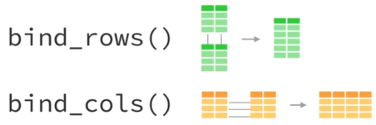

```{r setup, include=FALSE}
knitr::opts_chunk$set(echo = TRUE)
library(crimedata);library(dplyr);library(tidyr)
```

# Preamble

This page contains material for _NSCR Carpentries_, a two-day workshop hosted by the [NSCR](https://nscr.nl/) with support from [Data and Software Carpentries](https://carpentries.org/) on 5 and 12 October, 2022.

# Background

Last week, we covered various different **transform** functions such as `filter()`, `mutate()` and `group_by()`. Most or all of the functions we used were in `dplyr` - a popular and powerful package within the `tidyverse`.

This morning, we extend that a little by covering _joining_ (or 'merging'), which is useful when we want to 'join' or 'stick' two (or more) datasets together. After that, we cover **tidy** functions within the aptly named `tidyr` package -- again, all within the `tidyverse`. This includes the long-wide and wide-long transformations. In the afternoon we cover data visualization. As you will have realised, we are focusing on the `tiyverse` set of packages, so make you sure you have it installed and loaded in your script for the day!

# Joining

It is likely that at some point you will need to join two datasets together. For example, if you wanted to examine the relationship between police-recorded crime and neighbourhood deprivation, you would probably need to collate data from two sources: the police, and the census bureau, and then join the two datasets together by some common variable, such as a neighbourhood name or id code. Here, we cover two ways of joining datasets together. The first is **binding** which simply 'sticks' to datasets together. The second is **joining** which performs a merge based on one or more variables which are common between the datasets.

## Binding

One of the crudest (but often perfectly acceptable) ways of sticking dataframes together is 'binding'. You can either bind top-to-bottom using `bind_rows()` or side-by-side using `bind_cols()`. This is demonstrated visually below. Note that when binding, there is no requirement for the datasets to have common identifier variables: you really are just sticking them together. This is easy but rather risky, as we will see.

<br>

<center>

{width="60%"}

</center>

<br>

### Row bind

Let's first demonstrate `bind_rows()`. We begin by re-downloading some of the US crime data that we used yesterday from the `crimedata` package. As before, ensure that the package is installed and loaded. This time, we download data for 2016 _and_ 2017^[You can actually specify more than one year within the `get_crime_data()` function. This is just a demonstration.]. To speed things up, we download only a sample of the whole data each time.

```{r, warning=F, message=F, results=F}
crimes_2016 <- get_crime_data(years = 2016, type = "sample")
crimes_2017 <- get_crime_data(years = 2017, type = "sample")
```

But what if we wanted to compare the two years? This would be most straightforward within the same dataframe. Because the two dataframes have exactly the same columns, we can use `bind_rows()` to stick them together top-to-bottom. Note that we specify an id variable to distinguish the two original dataframes.

```{r}
crimes_binded <- bind_rows(crimes_2016, crimes_2017, .id = "year")
```

<div style="background: ghostwhite; 
            font-size: 16px; 
            padding: 10px; 
            border: 1px solid lightgray; 
            margin: 10px;">

## Exercise

1. The new `year` variable we created above is not very informative. Create a new variable in both `crimes_2016` and `crimes_2017` called `data_year` which states the year. Then, re-do the row bind above.
2. Try altering the variable name in **one** of the datasets. For example, let's say we made a typo, and in one dataframe we called our new variable `data_years`. Then re-do the row bind. What happens and why?
3. Once you've (successfully) stuck the dataframes together, use `group_by()` and then `summarise()` to calculate the crime counts by year and by city. Look back at last week's material for some clues on how to do this.
      
</div>

You will see that the row bind **only works because the two dataframes have identical columns**. So, be sure to check these things before conducting a row bind, otherwise you might get an unexpected result.

### Column bind

Another way of finding dataframes is `bind_cols()`. This sticks dataframes together side-by-side. For that reason, you have to be **super careful** that the ordering of rows is appropriate before conducting a column bind. Let's create two dataframes of city-level counts for each year. 

```{r, message=F, warning=F}
city_counts_2016 <- crimes_2016 %>% 
  group_by(city_name) %>% 
  summarise(counts2016 = n())

city_counts_2017 <- crimes_2017 %>% 
  group_by(city_name) %>% 
  summarise(counts2017 = n())
```

If you eye-ball the above two dataframes, you can see that they are perfectly comparable: the same number of cities, both sorted alphabetically. So, if you conduct a simple column bind, it works fine, aside from the automatic renaming of common variables. You can then easily compare the counts across years, or calculate the difference between the two.

```{r, warning=F, message=F}
city_counts_2016_2017 <- bind_cols(city_counts_2016, city_counts_2017) 
```

But what happens if the order is different? We can simulate this by shuffling the order of one data frame, and then re-doing the bind. We do this by taking a sample without replacement. You will notice that we first `set.seed()` -- this ensures our sampling is reproducible. You can read more about that [here](https://stackoverflow.com/questions/13605271/reasons-for-using-the-set-seed-function).

```{r, warning=F, message=F}
set.seed(1612)

city_counts_2016_shuffle <- city_counts_2016 %>% 
  sample_n(size = nrow(city_counts_2016), replace = FALSE)

city_counts_2016_2017_shuffle <- bind_cols(city_counts_2016_shuffle, city_counts_2017) 
```

Now take a look at the result. Is it correct? If not, why not? While `bind_cols()` can be useful, always ensure that the ordering is correct before conducting such a bind, and be sure to check everything afterwards.

## Joining

Probably the most powerful way of merging dataframes together is by using a **join** function. These functions will match rows based on one or more common id (or 'key') variables. There are a number of different joins available within the `tidyverse`. While each are fundamentally the same, each one will treat non-matches differently. The four options available are `left_join()`, `right_join()`, `inner_join()` and `full_join()`. These are best summarised visually.

<br>

<center>

{width="60%"}

</center>

<br>

Let's demonstrate a join by re-trying our city-wide counts comparison between 2016 and 2017. To show the difference to a bind, we will use the shuffled 2016 data. First, let's remind ourselves what these two dataframes look like.

```{r}
city_counts_2016_shuffle
```

```{r}
city_counts_2017
```

Despite the different row ordering, the common id of `city_name` means that we can join the two datasets by the city name. You might notice from the above graphic that it doesn't even matter which join we use here, because each dataframe is equally complete. By way of demonstration, we use `full_join()`. 

```{r}
city_counts_joined <- full_join(city_counts_2016_shuffle, city_counts_2017, by = "city_name")

city_counts_joined # print the joined output
```


<div style="background: ghostwhite; 
            font-size: 16px; 
            padding: 10px; 
            border: 1px solid lightgray; 
            margin: 10px;">

## Exercise

1. For completion, we have explicitly stated that we are joining by `city_name`. What happens if we don't do this? Remove that option and re-try the join.
2. In one of the dataframes, change the `city_name` variable to something different (e.g., `city`). This forces you to practice `rename()` from last week, but is also recreates a more realistic scenario in which the common ID variables have different names.
3. Now, re-do the join. You will see that R cannot guess which variables are your common IDs. So, you will need to state them manually within the join function. Do this! Remember that Google is your friend, or check the help page within R (`?full_join`).
      
</div>

To explore the different joins more, let's introduce some differences. We create an incomplete 2017 dataframe by randomly sampling ten cities, and then re-trying the join. You will notice that this automatically identifies the missings, and retains them.

```{r}
set.seed(1612) # This ensures that the sample is reproducible.

city_counts_2017_subset <- city_counts_2017 %>% 
  sample_n(size = 10)

city_counts_joined_subset <-  full_join(city_counts_2016_shuffle, city_counts_2017_subset, by = "city_name")

city_counts_joined_subset
```

<div style="background: ghostwhite; 
            font-size: 16px; 
            padding: 10px; 
            border: 1px solid lightgray; 
            margin: 10px;">

## Exercise

1. What do you think would happen if we re-ran the above, but with `left_join()`? Try it out now, along with `right_join()` and `inner_join()`. The differences might be subtle, but important! 
      
</div>

# Tidy

So far, we have been going on about the `tidyverse` without really talking about tidy data. There is no better resource to explain tidy data than [this one](http://garrettgman.github.io/tidying/). We are not even going to try and beat that. So, definitely have a read at some point! But for now, we can summarise tidy data by borrowing their definition: a tidy dataset is one in which _each variable is placed in its own column, each observation in its own row, and each value in its own cell._ There is a graphical representation of this below. 

<br>

<center>

{width="60%"}

</center>

<br>

To some of you, this might be intuitive: it might seem obvious that data is in a tidy format, but **you would be surprised what hell some people call a dataframe**. In real life, colleagues, companies and governments will share spreadsheets which do not fit this definition of 'tidy', and we are left to wrangle away until it is tidy. Luckily, we have already learnt many of the skills needed to tidy data, but one important one remains: long to wide pivots (and vice-versa).

## Preperation

To demonstrate these pivots, we will make use of some open data from the London Fire Service contains information about calls for service involving animals.  To prepare for this, we need to run an R script which will download and prepare the data for us. This is partly practical, but partly a nice demonstration of the `source()` function. With this function, we can run a pre-existing R script without even opening it. Assuming you have downloaded all the material for this course, and that you are working in the R project file, all you need to do is run the following in a new R script. 

```{r, eval = F}
# This will run the R script in the background, in order to prepare some nice data.
source(file = "scripts/tidy_prep.r")
```

```{r, echo = F, message=F, warning=F, results=F}
setwd("C:/Users/langt/Documents/GitHub/nscr_carpentries") # temporary hack.
source(file = "scripts/tidy_prep.r")
```


## Wide to long

First, let's print our first example data frame to the Console.

```{r}
fire_wide1_df 
```

This dataframe contains information about the number of calls received by the London Fire Service between 2009 and 2018 involving particular animals. For example, there were 85 incidents in 2013 involving birds. This data is in **wide format**. How can we tell? Well, it can be tricky. But consider the first part of our (borrowed) definition: _each variable is placed in its own column_. The variable `animal_group_broad` makes sense: it is a categorical variable defining the animals involved. But what is `2009`? What is `2011`? These columns are pretty much the same variable: a currently non-existing column called 'yearly count', which is simply an incident count. 

If we wanted to calculate fairly basic things, for example, the total number of incidents during the study period, or the mean number of incidents during the study period for each animal category, it would be pretty difficult due to the data format. To make things easier, we want to _pivot from wide to long_.

We do this using a function called `pivot_longer()`. The first input is the wide data frame we want to pivot, in our case, `fire_wide1_df`. We then specify the columns we want to pivot (in our case, all the year columns), a new variable name to define the columns (in our case, years), and a new variable to define whatever the values in the cells are (in our case, incident counts). Note that we are pivoting _all_ columns _except_ the animal classification, hence the use of `-`. 

```{r}
fire_long1_df <- fire_wide1_df %>% 
  pivot_longer(cols = -animal_group_broad, names_to = "years", values_to = "counts") 
```

We will be honest: **it is not always immediately clear what the `cols`, `names_to` and `values_to` options are**. If you are really not sure, we recommend taking a small sub-sample of the data (e.g., using `sample_n()`) and testing things out. There's no shame in this!

Now print the output to take a look.

```{r}
fire_long1_df
```

This might seem less intuitive for our eyes, but it makes things way easier for computers. Now, for example, we can perform a number of useful operations using some of the skills we learnt last week. The following calculates the mean number of incidents for each animal category, for example.

```{r}
fire_long1_df %>% 
  group_by(animal_group_broad) %>% 
  summarise(mean_counts = mean(counts))
```

As we will discuss later, making graphics in R is also all about the long data! This will become clear this afternoon.

## Long to wide

Sometimes, we will need to pivot the other way round: from long to wide. A common reason for this is to make a table for a paper or presentation. Computers like long data, but humans sometimes find wide format a bit more intuitive to read. Let's print out a long dataframe example from the London Fire Service data.

```{r}
fire_long2_df 
```

This data is in long format. Each column is a distinct variable, and values are repeated across rows to reflect grouping (e.g., different property types nested within animal categories). We just have one variable containing the counts. We can pivot this to wide format using `pivot_wider()`. This time, we specify the variable which we are going to create new columns from (in this case, property type: one column for each unique value), and the existing variable which we are going to take the cell values from (in this case, counts).

```{r}
fire_wide2_df <- fire_long2_df %>% 
  pivot_wider(names_from = "property_type", values_from = "counts")
```

Again, let's print the output to check what happened. We can see that the variable specified in `property_type` has been spread across columns, and the values for each has been taken from the existing `counts` variable.

```{r}
fire_wide2_df
```

That's it! That's long to wide and back again.

## Unite

Another useful tidying function is `unite()`. Fortunately, it's a lot easier to get your head around compared to pivots. This function will simply pastes together the contents of columns. Let's demonstrate this using the raw fire service data. We have two variables `property_type` and `property_category` which describe where the incident took place. We can preview these variables by printing their unique values to the Console using `distinct()`.

```{r}
distinct(fire_clean_df, property_type)
```

```{r}
distinct(fire_clean_df, property_category)
```

What if we wanted to combine these categories into a new variable? This is where `unite()` comes in. Note that we first state the new variable name, the variables we want to unite, and how we want to separate them in the new variable.

```{r}
fire_clean_df <- fire_clean_df %>% 
  unite(col = "property_description", 
        property_type, property_category,
        sep = " - ")
```

By default, `unite()` will remove the variables you have united. Take a look at the help documentation `?unite` to find out how you can turn this option off, and keep the original variables.

<div style="background: ghostwhite; 
            font-size: 16px; 
            padding: 10px; 
            border: 1px solid lightgray; 
            margin: 10px;">

## Exercise

1. The opposite of `unite()` is `separate()`. Unsurprisingly, this function can be used to separate a variable into two or more other variables. Let's say we wanted to identify the _year beginning_ and _year end_ of each incident. Use `separate()` to split `fin_year` into two new variables called `year_begin` and `year_end`.
      
</div>

# Acknowledgements

This material is based on both the materials and experience of teaching with colleagues from the [Space Place and Crime working group](https://github.com/langtonhugh/ESC2019) and the [Methods@Manchester summer school](https://rcatlord.github.io/GSinR/).
