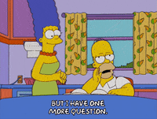
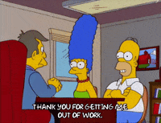

```{r setup, include=FALSE}
knitr::opts_chunk$set(echo = FALSE)
```

## NSC-R team

-   Wim Bernasco
-   Sam Langton
-   Asier Moneva
-   Alex Trinidad
-   Franziska Yasrebi-de Kom


## About you

## Why learn R?

- free
- reproducibility
  - yourself
  - others
- diverse
- makes your life easier
- community driven
- [growing popularity](https://rcatlord.github.io/GSinR/modules/intro/slides/slides.html#8) 

## Learning curve

<center>

{width="65%"}

</center>

Source: unknown

## The workshop

- Help participants transform from R novices to R users!
- Structured along a typical workflow
- Supported by [Data and Software Carpentries](https://carpentries.org/)
- Material is online and open

## Workflow

<br>

<center>

{width="80%"}

</center>

<br>

<br>

Source: [R for Data Science](https://r4ds.had.co.nz/)

## Workflow

<br>

<center>

{width="80%"}

</center>

<br>

<br>

Source: [R for Data Science](https://r4ds.had.co.nz/)

## What will you learn?

- read and write basic R code
- import data into RStudio
- subset and filter your data
- recode and create new variables
- pivot data (long-wide)
- prepare data for analysis
- visualise

## Workshop contents

### Day 1 (5 October)

- The basics
- Packages
- Import 
- Explore
- Transform

### Day 2 (12 October)

- Tidy
- Join
- Visualise

## Workshop ethos

<center>

{width="65%"}

</center>

## Day 1: morning

**09:30-10:00**: Introduction

**10:00-11:00**: The basics

**11:00-11:15**: Coffee

**11:15-12:00**: Exercise: using a script

**12:00-13:00**: Lunch

## Day 1: afternoon

**13:00-14:00**: Import & explore

**14:00-14:45**: Exercise: import & explore

**14:45-15:00**: Coffee

**15:00-16:00**: Transform

**16:00-16:45**: Exercise: transform

**16:45-17:00**: Closing

## Material

All slides and worksheets are available online:

<center>

https://t.ly/6NM_ 

OR

https://github.com/langtonhugh/nscr_carpentries/archive/refs/heads/main.zip 

</center>

## Day 2: morning

**09:30-10:00**: Introduction

**10:00-11:00**: Joining

**11:00-11:15**: Coffee

**11:15-12:00**: Exercise: joining

**12:00-13:00**: Lunch

## Day 2: afternoon

**13:00-14:00**: Tidy

**14:00-14:45**: Exercise: tidy

**14:45-15:00**: Coffee

**15:00-16:00**: Visualise

**16:00-16:45**: Exercise: visualise

**16:45-17:00**: Closing

## Closing

<center>

{width="70%"}

</center>
